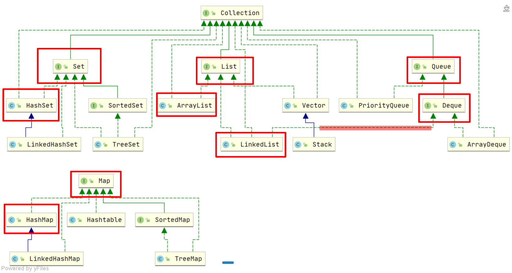
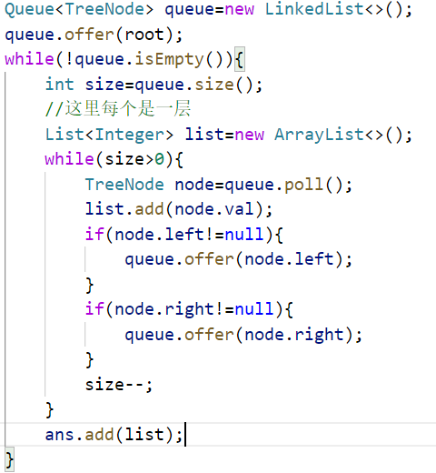
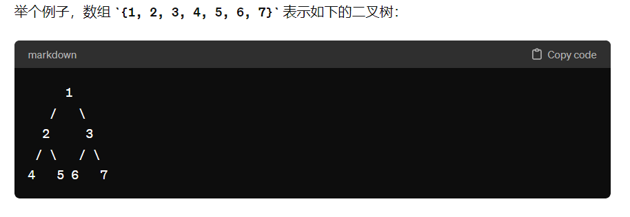

# 二叉树的遍历

> bg:最近有把二叉树的前中后序遍历+层序遍历完成，今天做个小结顺便把涉及到的题目简单过一遍。
>
> 尤其是递归+迭代的双解法

## 1.前序遍历

### 递归

> 递归法呢，只要理解了都是比较简单的，也不用多想。我对递归其实也不是很会写，可能目前最大的感想估计就是说看递归最好站在高处看它，抓住递归函数是要干嘛，再去思考里面的递归终止条件和递归式
>
> ```java
> class Solution {
>     public List<Integer> preorderTraversal(TreeNode root) {
>         List<Integer> res = new ArrayList<Integer>();
>         preorder(root, res);
>         return res;
>     }
>     //先序遍历  中——左——右
>     public void preorder(TreeNode root, List<Integer> res) {
>         if (root == null) {
>             return;
>         }
>         res.add(root.val);
>         preorder(root.left, res);
>         preorder(root.right, res);
>     }
> }
> 
> //或者呢也可以把res作为全局变量，这样在递归函数中就可以不传入参数来存储节点数据了。
> 
> ```
>
> 


### 迭代

> 迭代法是我认为需要好好掌握的，对我个人而言有以下两点：1.他会涉及到一些数据结构  2.他有更多的操作空间（递归能写出来就很好了，但很可能不好去想它中间的过程，所以很多题目需要在其中去加入一些处理的话就不太好弄了）
>
> ```java
> 
> //注意：我们这里演示的是迭代风格不统一的代码，和层序遍历很类似，只不过实现是使用栈实现的
> //当然也可以根据个人喜好选择与中序遍历风格一致的代码
> class Solution {
>  public List<Integer> preorderTraversal(TreeNode root) {
>      
>      List<Integer> list =new ArrayList<>();
>      Deque<TreeNode> stack=new LinkedList<>();
>      if(root==null){
>          return list;
>      }
>      stack.push(root);
>      while(!stack.isEmpty()){
>          TreeNode node= stack.pop();
>          //中间节点，最先
>          list.add(node.val);
>          //先加入右边节点，后出
>          if(node.right!=null){
>              stack.push(node.right);
>          }
>          //后加入左子树，先出
>          if(node.left!=null){
>              stack.push(node.left);
>          }
>      }
>      return list;
> 
>  }
> }
> /*与中序统一的方式；基本想法是，先把所有中间节点add，再放左，回溯，再放右
> while (!stack.isEmpty() || node != null) {
>          while (node != null) {
>              res.add(node.val);
>              stack.push(node);
>              node = node.left;
>          }
>          node = stack.pop();
>          node = node.right;
> }
> */
> ```
>
> 解释：
>
> 1.我们使用Deque来模拟栈，Queue做不到对吧，同时实现的接口是LinkedList，可以记住集合的基础关系
>
> 
>
> 红框是最常用的几个，当然其他不常用的原因也要自己对比一下。
>
> 


## 2.中序遍历

### 递归

> 略：同上
>


### 迭代

> 中序遍历很重要，因为左——中——右的这种递归方式结合二叉搜索树或者有序数组很好出题，所以这个迭代法一定要记住！（比如二叉搜索树的第K大的数）
>
> ```java
> //前序
> while (!stack.isEmpty() || node != null) {
>       while (node != null) {
>           res.add(node.val);
>           stack.push(node);
>           node = node.left;
>       }
>       node = stack.pop();
>       node = node.right;
> }
> 
> //中序：其实也就是把前序调换了一下位置，why？前序是先加root再加left
> //而中序则是先加left，再加root
> while (!stack.isEmpty() || node != null) {
>       while (node != null) {
>           //res.add(node.val);
>           stack.push(node);
>           node = node.left;
>       }
>       node = stack.pop();
>       res.add(node.val);//调换到此处
>       node = node.right;
> }
> 
> 如果不清楚的话可以模拟几遍，相信会清楚不少
> ```
>
> 


## 3.后序遍历

### 递归

> 略：同上
>


### 迭代

> 后序遍历的迭代法我们借助前序遍历来解决
>
> 前序不是：中——左——右吗，那我们加入节点时调换左右节点位置，变为中——右——左。
>
> 再把这个结果颠倒就是咱们需要的左-右-中了。之所以要采用这种间接的方式也是因为其迭代法不太好去实现理解。
>
> Colletctions.reverse(result);


## 4.层序遍历

### 迭代

> 因为层序遍历的递归感觉很抽象，也没太必要记住（有错纠正），所以这里只演示层序遍历的迭代法。层序遍历呢也是十分重要的一个知识点，可以出题的方向有很多地方，其书写也是很简单易懂。
>
> 
>
> 
>
> ```java
> 层序遍历这边使用 队列这种数据结构来实现
> ```
>
> 常见题目：如二叉树的右视图


# 二叉树的构造

**一般传入数组为`层序遍历`：**



构造的方式采用递归方案：`new根节点`，再`递归构造左右子树`

```java
//此递归函数的含义在于：构建以index的数组元素为root的一棵树。注意为什么是这个index
private TreeNode constructBinaryTree(int[] array, int index) {
        TreeNode node = null;

        // 判断索引是否超出数组范围
        if (index < array.length) {
            node = new TreeNode(array[index]);
            node.left = constructBinaryTree(array, 2 * index + 1); // 构建左子树
            node.right = constructBinaryTree(array, 2 * index + 2); // 构建右子树
        }

        return node;
}
```

