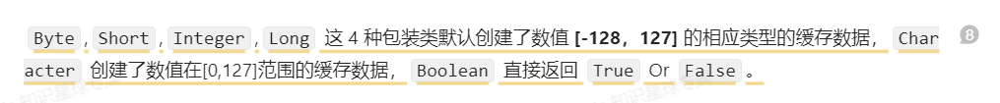
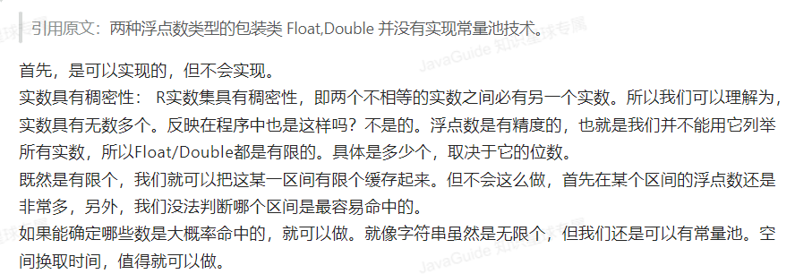

# 第一次模拟

## MySQL

基础架构 存储引擎 **事务** **锁** **索引** 日志 优化

1.对于一条查询语句，在MySQL中是如何执行的呢？

2.MySQL事务的特性有哪些？原子性/隔离性/持久性 分别通过什么来保证的呢

3.常见的事务隔离级别有哪些？MySQL默认的级别是什么呢？MySQL中是如何实现可重复读的呢，是通过加锁吗~~可以解决幻读问题吗？~~

4.MVCC能讲下吗，是什么，实现MVCC的核心是什么？

5.数据库索引是干嘛的，还能举出其他空间换时间的例子吗[缓存/数据表的冗余]

6.MySQL的索引底层实现了解吗？和B树的区别，为什么不用哈希表-平衡树？

7.主键索引和二级索引的区别是？讲讲覆盖索引呢？联合索引设置时一般如何安排顺序？索引下推有了解过吗？

## java并发

乐观锁和悲观锁   线程池  线程相关

1.线程的生命周期了解吗？创建线程的常见方式

2.线程池有使用过吗？有哪里几种方式创建？推荐的这种方式它的原理是什么？执行流程

3.乐观锁和悲观锁的区别是？乐观锁的常见实现？CAS具体讲讲呢？

> 参考：https://www.yuque.com/snailclimb/mf2z3k

## 反馈内容

### 田 to 韦

1.MVCC是什么，用于实现什么事务隔离级别，MVCC是通过什么实现的？

2.MySQL的索引是怎么在磁盘中存储的，为什么选择B+树，比B树优于哪里？

> 参考以下信息：
>
> 1.磁盘的结构：https://blog.csdn.net/weixin_37641832/article/details/103217311
>
> 2.B+树在磁盘中的存储：https://juejin.cn/post/6844903856388718606
>
> 3.为什么b+树都是3-4层：https://zhuanlan.zhihu.com/p/86137284

3.联合索引的作用？联合索引如何安排字段顺序？

### 韦 to 田

1.包装类型的**`常量池技术`**针对`8种基本类型的包装类型`都有吗？

>  
>
> 而针对`浮点型`的包装类型double、float则没有必要实现常量池。具体参考下图
>
>  

2.在没有`重写`的情况下，对于引用数据类型来说：`==和equals的效果一致`

3.父类private/final/staic方法不可被子类重写

4.hashMap的扩容机制与数据迁移

> 